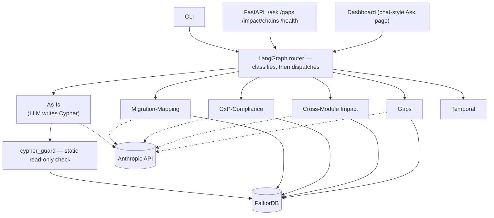

<!--
NOTE: This file has been sanitized for public/private portfolio use.
Business logic, domain-specific rules, and proprietary details have been masked.
The coding patterns, architecture, and technical implementation remain authentic.
[MASKED] tags indicate where original business logic has been replaced.
-->

<div align="center">

# SAP GraphRAG Migration Engine

**Ask plain-English questions about a SAP ECC 6.0 → S/4HANA migration and get answers graded by evidence, not guesswork.**


[Quickstart](#quickstart) · [Architecture](#architecture) · [API](#api-reference) · [Configuration](#configuration) · [Testing](#testing--ci) · [Docs](#documentation)

</div>

---

## What this is

NovaPharm Biologics is migrating its SAP system from ECC 6.0 to S/4HANA — a GxP-regulated
pharma manufacturing environment (Materials Management + Asset Accounting). This repo
builds a knowledge graph of that migration and a natural-language layer on top of it,
so a question like *"what does business process MM01 use?"* or *"what's the compliance
risk with the batch-release interface?"* gets answered from real graph data instead of
a plausible-sounding guess.

**The one rule everything else is built around:** every fact the system states is
tagged `documented` (a real source backs it) or `inferred` (an analyst's or AI's best
guess) — and `inferred` facts are never silently promoted to fact. If there's no data
to answer a question, the system says so instead of making something up.

## Features

- 🕸️ **Property graph of the actual migration data** — FalkorDB, loaded from source CSVs, schema-validated against a data dictionary before a single row is written
- 🧠 **6 specialized agents + 1 router** — each question is classified (by an LLM tool-call, not keyword matching) and routed to exactly one purpose-built agent
- 🔒 **Two independent write-guards** — a static Cypher validator *and* a database-level read-only enforcement on the one agent that generates its own queries
- 📊 **Confidence-graded everything** — nodes and edges carry `documented` / `peripheral` / `gap` / `inferred`, enforced structurally, checked by an automated health gate
- 💬 **Chat-style dashboard** — 2-column Ask page, JSON API, and a CLI, all three calling the exact same underlying logic
- 🧪 **Golden-question eval harness** — real regression testing against actual LLM answers, not just unit tests
- 📝 **Full audit trail** — structured JSON logging of every Cypher write and every agent decision

## Architecture



Only **As-Is** lets an LLM generate its own Cypher — every other agent runs a fixed,
hand-verified query and only uses the LLM to turn already-correct rows into prose.
Full diagrams + request-flow sequence: [`docs/TECHNICAL_REFERENCE.md`](docs/TECHNICAL_REFERENCE.md#2-architecture).

## Prerequisites

| Tool | Version | Why |
|---|---|---|
| [uv](https://docs.astral.sh/uv/) | latest | dependency management + lockfile |
| Docker + Docker Compose | any recent | runs FalkorDB |
| Python | 3.12+ | runtime |
| Anthropic API key | — | powers every agent's narration/classification |

## Quickstart

```bash
git clone https://github.com/yourusername/kgme-portfolio.git && cd kgme-portfolio/kg-migration-engine
cp .env.example .env          # set FALKORDB_PASSWORD and ANTHROPIC_API_KEY
make setup                    # install deps + pre-commit hooks
make up                       # start FalkorDB (Browser: http://localhost:3000)
make load                     # build the graph, then print verification
make lint && make test        # quality gates
make api                      # run the API + dashboard on :8000
```

`make load` should end with `nodes_ok=true edges_ok=true provenance_ok=true`
(55 nodes / 47 edges). Then open `http://localhost:8000/dashboard/ask` and ask a
question, or:

```bash
curl -X POST http://localhost:8000/ask \
  -H 'Content-Type: application/json' \
  -d '{"question": "What SAP transactions does business process MM01 use?"}'
```

## API reference

| Method | Path | Returns |
|---|---|---|
| `POST` | `/ask` | `{route, answer, blocked}` — routes an NL question to one of 6 agents |
| `GET` | `/gaps` | Gap-confidence nodes + inferred-confidence edges |
| `GET` | `/module/{module}/impact` | Node/coverage breakdown for one module |
| `GET` | `/impact/chains` | Cross-module reconciliation chains (MM ↔ AM) |
| `GET` | `/health` | Liveness/readiness/deep DB checks |

Full request/response models: [`src/kgme/api/schemas.py`](src/kgme/api/schemas.py).

## Configuration

Set in `.env` (copy from `.env.example`):

| Variable | Required | Notes |
|---|---|---|
| `FALKORDB_HOST` / `FALKORDB_PORT` | no | default `localhost:6379` |
| `FALKORDB_USERNAME` / `FALKORDB_PASSWORD` | **yes** | no default — fails fast at startup if unset |
| `FALKORDB_GRAPH` | no | default `kgme` |
| `ANTHROPIC_API_KEY` | **yes** | no default |
| `ANTHROPIC_MODEL` | no | default `claude-sonnet-5` |

## Project structure

```
CLAUDE.md .mcp.json      Claude Code control (root)
cypher/                  05_verify.cypher — the load's self-check
data/raw/                pristine source CSVs (protected, immutable)
src/kgme/
├── config.py, core/     settings, exceptions, structured logging
├── db/                  driver, schema validation, loader, health, gaps
├── enrichment/          s4_simplification.py, disposition.py
├── agents/              as_is, mapping, compliance, impact, gaps, temporal, graph (router)
├── api/                 FastAPI app + JSON schemas
└── dashboard/           server-rendered views (chat-style Ask page)
tests/                   unit / integration (testcontainers) / eval
docs/                    IMPLEMENTATION_PLAN.md, TECHNICAL_REFERENCE.md
```

## Testing & CI

```bash
make test        # pytest: unit + testcontainers-based integration, coverage-gated
make lint         # ruff check + format --check, mypy --strict
```

CI (`.github/workflows/ci.yml`) runs lint and the full test suite on every PR. Unit
tests mock the graph; integration tests run against a real, disposable FalkorDB
container. A separate golden-question eval harness (`tests/eval`, manual-run only —
needs a real API key + loaded graph) regression-tests actual agent answers.

## GxP guardrails

- Provenance (`confidence` + `source_doc`) on every node/edge, no exceptions
- LLM/derived output is always `inferred`, never promoted to `documented` without human review
- Loads are idempotent and reproducible (`uv.lock` pinned)
- Agent DB access is read-only, enforced at both the app layer (`cypher_guard`) and the DB layer (`GRAPH.RO_QUERY`)
- No CDN, no client-side JS framework anywhere in the dashboard — works fully offline in a validated environment

## Documentation

| Doc | For |
|---|---|
| [`docs/IMPLEMENTATION_PLAN.md`](docs/IMPLEMENTATION_PLAN.md) | Full build spec, phase by phase |
| [`docs/TECHNICAL_REFERENCE.md`](docs/TECHNICAL_REFERENCE.md) | Architecture, diagrams, every symbol |
| [`docs/HANDOFF_DETAIL.md`](docs/HANDOFF_DETAIL.md) | Domain background, prior-conversation context |
| [`CONTRIBUTING.md`](CONTRIBUTING.md) | Git workflow, zero-experience-required |

## Contributing

See [`CONTRIBUTING.md`](CONTRIBUTING.md) — written for zero prior GitHub experience.
Follow `docs/IMPLEMENTATION_PLAN.md` phase by phase; don't start a phase before the
previous one's Definition of Done is met.

## License

Portfolio sample — provided for demonstration purposes only, not licensed for
production or commercial use.
