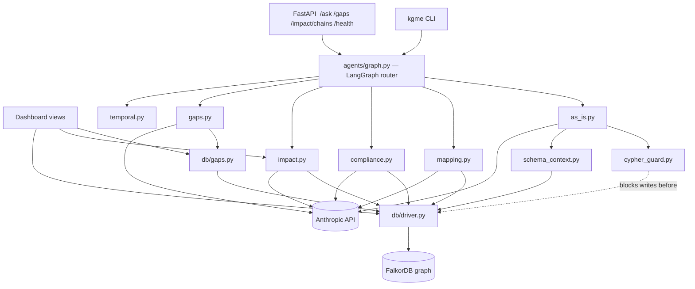
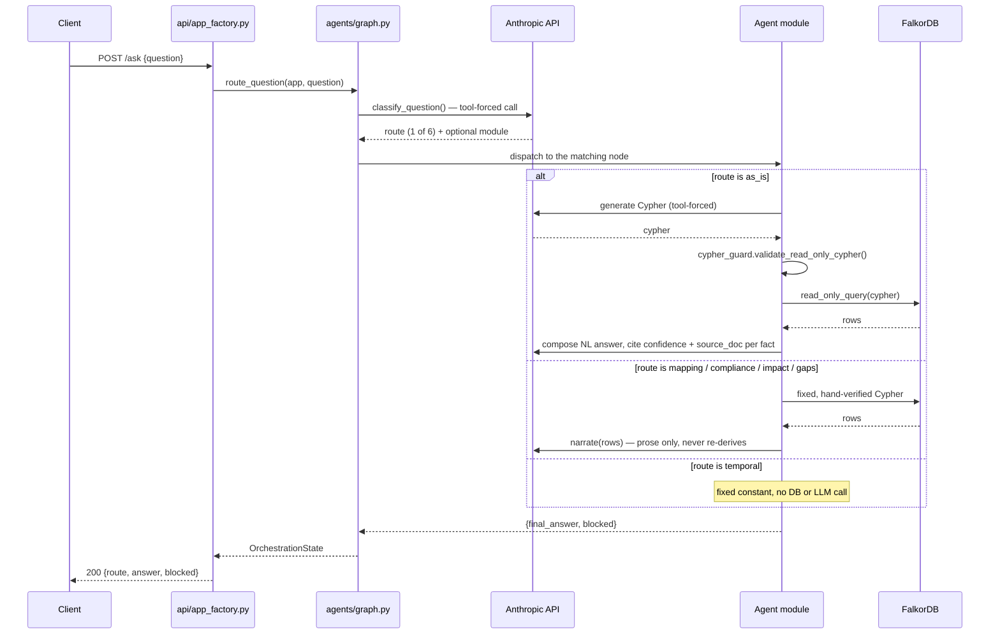

<!--
NOTE: This file has been sanitized for public/private portfolio use.
Business logic, domain-specific rules, and proprietary details have been masked.
The coding patterns, architecture, and technical implementation remain authentic.
[MASKED] tags indicate where original business logic has been replaced.
-->

# kgme — Full Technical Reference

Every module, class, function, and dependency in the codebase, organized by layer.
Written against `main` at commit `f761c37` (Phase 6).

Reads bottom-up through the real dependency stack: what it is → how it's wired →
what it's built on → the core domain concept → where files live → each layer in
depth (config/core → db → enrichment → agents) → how a question gets routed →
the three outer surfaces (API/dashboard/CLI) → ops → tests.

1. [System overview](#1-system-overview)
2. [Architecture](#2-architecture) — the two diagrams
3. [Technology stack](#3-technology-stack)
4. [The confidence model](#4-the-confidence-model)
5. [Package layout](#5-package-layout)
6. [config & core](#6-config--core)
7. [db layer](#7-db-layer)
8. [enrichment layer](#8-enrichment-layer)
9. [agents layer](#9-agents-layer)
10. [Routing walkthrough](#10-routing-walkthrough)
11. [API & dashboard](#11-api--dashboard)
12. [CLI](#12-cli)
13. [Infra & ops](#13-infra--ops)
14. [Testing & CI](#14-testing--ci)

---

## 1. System overview

kgme answers natural-language questions about a SAP ECC 6.0 → S/4HANA migration by
routing them to one of six purpose-built agents over a FalkorDB property graph, then
returns a confidence-graded answer — never a fabricated one. It is one Python package
(`src/kgme`) with six sub-packages, a FastAPI HTTP surface, a server-rendered
dashboard, and a CLI, all sharing the same underlying graph and agent logic.

The rest of this document reads bottom-up through that dependency stack — config and
core first, then the DB layer, enrichment, the six agents, the router that ties them
together, then the three outer surfaces (API, dashboard, CLI) that call the router —
finishing with the cross-cutting concerns (infra, testing) that apply to all of it.

---

## 2. Architecture

### 2.1 Layered dependency diagram

Arrows point from a caller to what it depends on. Three client surfaces at the top
all funnel through one router; the router fans out to six agents; every agent but
As-Is only ever runs fixed Cypher against the DB layer; only As-Is talks to the LLM
to *generate* Cypher (everyone else only uses the LLM to narrate results already
computed).



`temporal.py` has no outgoing edge on purpose — it never queries the graph or calls
the LLM; it is a fixed answer, because the graph has no date field for it to ask
about.

### 2.2 Request flow for `POST /ask`

The one path every natural-language question takes, end to end:



---

## 3. Technology stack

Pinned in `pyproject.toml`. Python 3.12, managed by `uv`.

| Role | Technology | Notes |
|---|---|---|
| Graph database | **FalkorDB** | Redis-protocol property graph, Cypher query language. Run via Docker (`docker-compose.yml`), driven by `falkordb-py` ≥1.0. |
| LLM provider | **anthropic** ≥0.40 | Tool-forced calls for classification/Cypher-gen, plain calls for prose composition. Model default: `claude-sonnet-5`. |
| Orchestration | **langgraph** ≥0.2 | `StateGraph` with one conditional-edge fan-out from a classify node to 6 terminal agent nodes. |
| Web framework | **FastAPI** ≥0.111 | JSON API + mounted dashboard router. Served by `uvicorn` ≥0.30. |
| Templating | **Jinja2** ≥3.1.6 | 5 server-rendered HTML views, no client JS framework, no CDN — offline-safe for a validated GxP environment. |
| Config | **pydantic** ≥2.7 / **pydantic-settings** ≥2.3 | Typed, fail-fast `Settings` loaded from `.env`; also the FastAPI response-model layer. |
| Logging | **structlog** ≥24.1 | JSON-structured, doubles as the GxP audit trail — every Cypher write, every agent decision. |
| Testing | **pytest** ≥8.2 + **testcontainers** ≥4.5 | Unit tests mock the graph; integration tests spin up a real, disposable FalkorDB container per test module. |
| Lint / types | **ruff** ≥0.6 / **mypy** ≥1.11 (strict) | 68 source files, zero `Any`-leak tolerance. CI runs `ruff check`, `ruff format --check`, and `mypy` as separate gates. |
| Packaging | **uv** + **hatchling** | `uv.lock` committed for reproducible installs. Two console scripts: `kgme-load`, `kgme`. |

---

## 4. The confidence model

Every node and edge in the graph carries a `confidence` value. This isn't cosmetic —
it's the one invariant nearly every module in this codebase either enforces or reads.
Nodes and edges draw from **overlapping but distinct** subsets of the same four values:

| Value | Nodes | Edges | Meaning |
|---|---|---|---|
| `documented` | ✓ | ✓ | Stated as fact in a held source document. |
| `peripheral` | ✓ | ✓ | Mentioned in passing — a cross-reference or diagram box. |
| `inferred` | ✗ never | ✓ | Derived by the analyst or a parser/agent — never a node's own confidence. |
| `gap` | ✓ | ✗ never | Referenced but never received — never an edge's own confidence. |

Enforcement lives in three places: `db/health.py`'s `check_provenance_complete()`
(every node/edge has `confidence` + `source_doc`, or the deep health check fails),
every enrichment writer (`disposition.py`, `s4_simplification.py`) hard-codes
`confidence='inferred'` with a `source_doc` prefixed `DERIVED:`, and
`agents/schema_context.py` states the node/edge asymmetry explicitly in every LLM
system prompt so the As-Is agent's generated Cypher never invents a node with
`confidence='inferred'`.

---

## 5. Package layout

```
src/kgme/
├── config.py            # Settings (pydantic-settings)
├── cli.py                # argparse entry points: kgme, kgme-load
├── logging.py            # thin re-export, see core/observability.py
├── core/
│   ├── exceptions.py     # KgmeError hierarchy
│   └── observability.py  # structlog config, run-id binding, metrics-as-logs
├── db/
│   ├── driver.py         # FalkorDB connection chokepoint
│   ├── schema.py         # data-dictionary validation (node_type/relation)
│   ├── loader.py         # Phase 1: CSV → graph, idempotent
│   ├── health.py         # liveness/readiness/deep checks
│   └── gaps.py           # fixed listing: gap nodes + inferred edges
├── enrichment/
│   ├── s4_simplification.py  # external SAP catalog → s4_* properties
│   └── disposition.py        # NovaPharm's own text → MIGRATES_TO edges
├── agents/
│   ├── llm_client.py      # Anthropic client factory
│   ├── schema_context.py  # live schema → LLM system-prompt text
│   ├── cypher_guard.py    # static read-only Cypher validator
│   ├── as_is.py           # NL → Cypher → NL (the only LLM-Cypher agent)
│   ├── mapping.py         # MIGRATES_TO coverage by module
│   ├── compliance.py      # GxP risk-narrative findings
│   ├── impact.py          # cross-module reconciliation chains
│   ├── gaps.py            # gap-node/inferred-edge narration
│   ├── temporal.py        # fixed honest answer, no query
│   └── graph.py           # LangGraph orchestrator, 6-way router
├── api/
│   ├── app_factory.py     # create_app(): FastAPI wiring, DI
│   ├── main.py            # uvicorn entry point (real client/graph)
│   ├── schemas.py         # Pydantic request/response models
│   └── service.py         # shared aggregation (module impact)
└── dashboard/
    ├── routes.py          # 5 server-rendered views
    └── templates/*.html   # Jinja2, no JS framework
```

---

## 6. config & core

### `config.py` — Typed runtime settings

One class, loaded once per process from environment / `.env` via `pydantic-settings`.
Fails fast — `falkordb_password` and `anthropic_api_key` are required fields with no
default, so a missing secret raises at startup, not mid-request.

| Symbol | Kind | Notes |
|---|---|---|
| `Settings` | class (`BaseSettings`) | Fields: `falkordb_host/port/username/password/graph`, `anthropic_api_key/model`. |
| `load_settings()` | function | Constructs `Settings()`; every entry point (CLI, API, tests) calls this exactly once. |

### `core/exceptions.py` — Typed error hierarchy

Every application-raised failure is one of these — no bare `Exception`, no silent
swallowing, per the GxP "fail fast and loud" rule.

| Symbol | Raised by |
|---|---|
| `KgmeError` | base class |
| `ConnectionUnavailableError` | `db/driver.py` — FalkorDB unreachable |
| `LoadAbortedError` | `db/loader.py` — any load step throws |
| `SchemaViolationError` | `db/schema.py` — unlisted `node_type` / malformed relation |
| `ProvenanceViolationError` | reserved, unused today |
| `CypherGuardViolationError` | `agents/cypher_guard.py` — write clause detected |

### `core/observability.py` — structlog config + audit-trail helpers

JSON logging is the audit trail in a GxP context, not just diagnostics — every
generated Cypher query, every enrichment write, every agent routing decision passes
through this module.

| Symbol | Kind | Notes |
|---|---|---|
| `configure_logging()` | function | Idempotent structlog setup; JSON renderer by default. |
| `get_logger(component)` | function | Returns a `structlog.stdlib.BoundLogger` bound to a component name. |
| `bind_run_id()` | function | Correlates every event from one CLI invocation with a uuid4. |
| `timed_event()` | context manager | Yields a mutable dict; logs status + duration_ms on exit, re-raises on error. |
| `metric()` | function | Structured metric-as-log-line (`event="metric"`) — the metrics system, for now. |
| `log_fact()` | function | Logs a specific node/edge's `confidence` + `source_doc` — the audit-trail primitive. |

---

## 7. db layer

Everything that touches FalkorDB directly. No module outside `db/` and `agents/` ever
imports `falkordb`.

### `db/driver.py` — Connection factory + query chokepoint

FalkorDB's Python client is stateless per call against a named graph — no
session/context-manager model like `neo4j-driver`. `AccessMode.READ` routes through
`Graph.ro_query`, which the FalkorDB engine itself rejects write clauses on: a real
DB-level guarantee beneath the app-level `cypher_guard`.

| Symbol | Kind | Notes |
|---|---|---|
| `AccessMode` | StrEnum | `READ` / `WRITE` |
| `build_client(settings)` | function → FalkorDB | Eager `ping()`; raises `ConnectionUnavailableError` on failure. |
| `get_graph(client, settings)` | function → Graph | The single chokepoint for a `Graph` handle. |
| `run_query()` / `read_only_query()` | functions | Documented mode dispatch — in practice, agent code calls `graph.ro_query()` directly (see §8). |

### `db/schema.py` — node_type / relation validation

FalkorDB (like Neo4j) cannot parameterize a label or relationship type — they must be
literal Cypher. This module is what makes it safe to interpolate a CSV-sourced string
into that position: `node_type` is checked against a closed enum from
`kg_data_dictionary.csv`; `relation` is checked against an `UPPER_SNAKE_CASE` shape
(the dictionary's relation enum is truncated — only a subset of the real values — so
a closed check would wrongly reject real data).

| Symbol | Kind | Notes |
|---|---|---|
| `RELATION_SHAPE` | compiled regex | `^[A-Z][A-Z0-9_]*$` |
| `DataDictionary` | frozen dataclass | `allowed_node_types`, `documented_relations` (both `frozenset[str]`) |
| `load_data_dictionary(path)` | function | Parses the dictionary CSV's enum rows. |
| `validate_rows_against_dictionary()` | function | Raises `SchemaViolationError` fail-fast on any bad `node_type`/malformed `relation`; logs (never raises on) shape-valid-but-undocumented relations. |

### `db/loader.py` — CSV → graph, the Phase 1 pipeline

Reads `kg_nodes.csv`/`kg_edges.csv` as `utf-8-sig`, validates via `db/schema.py`, then
writes via native constraint + `UNWIND`-batched parameterized `MERGE`, grouped by
`node_type`/`relation` (the one thing that can't be parameterized). Idempotent —
`MERGE` keyed on `node_id`/`edge_id`.

| Symbol | Kind | Notes |
|---|---|---|
| `StepResult` | frozen dataclass | `step, ok, summary, duration_ms` |
| `read_csv_rows(path)` | function | Shared by `enrichment/disposition.py` too. |
| `wipe_graph()` | function | Dev-only, double-gated on an explicit flag *and* `KGME_ALLOW_WIPE=1`. |
| `load_graph()` | function | Runs constraints → load_nodes → load_edges → promote_labels → verify. Any step but `verify` aborts the run on failure. |

Pipeline steps (each a private function, run via `_run_step()`):

| Step | What it does |
|---|---|
| `constraints` | Creates the `Entity.node_id` uniqueness constraint if absent. |
| `load_nodes` | One `UNWIND ... MERGE` for all nodes. |
| `load_edges` | Grouped by `relation` (literal Cypher position) via `itertools.groupby`. |
| `promote_labels` | Adds each node's `node_type` as a real Cypher label (e.g. `:Entity:Transaction`). |
| `verify` | Runs `cypher/05_verify.cypher` — count/provenance assertions. Never raises; returns booleans. |

### `db/health.py` — Liveness / readiness / deep checks

Framework-agnostic — zero web imports, so `GET /health` and `kgme db check` both wrap
it directly.

| Symbol | Kind | Notes |
|---|---|---|
| `CheckResult` / `HealthReport` | frozen dataclasses | `HealthReport.healthy = all(c.ok for c in checks)` |
| `check_connectivity()` | function | Bare Redis `ping()`. |
| `check_graph_selected()` | function | `RETURN 1` against the configured graph. |
| `check_constraints()` | function | Confirms the `Entity.node_id` constraint exists and isn't `FAILED`. |
| `check_provenance_complete()` | function | `deep=True` only — confirms zero nodes/edges are missing `confidence`/`source_doc`. |
| `run_health_checks()` | function | Composes the above; `deep` flag gates the provenance check. |

### `db/gaps.py` — Fixed listing: gap nodes + inferred edges

No LLM. Two fixed Cypher queries, the two confidence-model markers CLAUDE.md defines
as risk signals. Consumed by `GET /gaps`, the Gap Explorer dashboard view, *and* (as
of Phase 6) `agents/gaps.py`'s NL-narration wrapper.

| Symbol | Kind |
|---|---|
| `GapNode` / `InferredEdge` | frozen dataclasses |
| `list_gap_nodes(graph)` | function — `WHERE n.confidence = 'gap'` |
| `list_inferred_edges(graph)` | function — `WHERE r.confidence = 'inferred'` |

---

## 8. enrichment layer

Two independent, non-interactive batch jobs that layer derived properties onto
existing nodes — neither ever creates a node. Run manually via `kgme enrich ...`,
never automatically.

### `enrichment/s4_simplification.py` — External SAP catalog → `s4_*` properties

Source: the public SAP Simplification Item Catalog, human-extracted to JSON (never
agent-fetched). Deterministic string-equality matching against existing `node_id`s —
fails closed: `Program`/`Concept` catalog rows have no corresponding node type in this
graph (no ATC scan has run yet) and are reported separately, never written.

First run against the fictional sample graph (this session): 6 of 55 nodes matched (4
AM, 2 MM), 29 catalog rows unmatched (most of the wider SAP landscape the catalog
covers isn't in this graph), 7 skipped (`Program`/`Concept`). Two concrete findings
from that run: one node (`TX:MB1C`) got independent corroboration of
`disposition.py`'s own `inferred` `MIGRATES_TO`→`MIGO` guess from this completely
separate source; two more AM nodes got a real, previously-invisible
`s4_severity="Functional Gap (Process will break)"` flag. Surfaced in
`api/service.py`'s `compute_module_impact()` → `s4_flagged_nodes` and the Module
Impact dashboard view — this data used to sit on nodes with no dashboard/API surface
at all.

| Symbol | Kind |
|---|---|
| `PREFIX_BY_ECC_OBJECT_TYPE` | dict — `Transaction→TX:, Table→TAB:, Auth_Object→AUTH:` |
| `CatalogRow` | frozen dataclass — one catalog row |
| `MatchResult` / `EnrichmentSummary` | frozen dataclasses |
| `load_catalog(path)` | function — reads the JSON, `utf-8-sig` |
| `extract_codes(name)` | function — splits multi-value cells by shape, not a stopword list |
| `match_catalog_to_nodes()` | function — pure, testable independent of any graph |
| `build_enrichment_properties(row)` | function — always `inferred`, `source_doc='DERIVED:SAP_SIMPLIFICATION_LIST'` |
| `enrich_graph()` | function — one batched `UNWIND ... SET`, idempotent (no MERGE/CREATE) |

### `enrichment/disposition.py` — NovaPharm's own text → `MIGRATES_TO` edges

Parses two NovaPharm-authored text sources — `kg_nodes.csv`'s `notes` field and
`kg_process_master.csv`'s `s4_disposition` column (that column's own author calls it
"my migration call... opinion, not source" — hence every derived fact is `inferred`).
Unparseable text is reported, never guessed at; a fact whose node doesn't exist is
reported, never used to create one.

| Symbol | Kind |
|---|---|
| `DispositionFact` | frozen dataclass — `kind: "migrates_to" \| "status_only"` |
| `UnparsedEntry` / `DispositionSummary` | frozen dataclasses |
| `extract_key_transaction_codes()` | function — its own separator convention, deliberately not reused from s4_simplification's `extract_codes()` |
| `parse_node_notes()` | function — handles `"S/4: abgeschaltet -> X"`, `"abgeschaltet"` alone, `"zentrale TA"` |
| `parse_process_disposition()` | function — handles `"Zwangsumbau (X->Y)"`, wildcard `"MB1*->MIGO"` resolved against that row's own `key_transactions`, and `"(X bleibt)"` |
| `load_dispositions()` | function — runs both parsers over both CSVs |
| `apply_dispositions()` | function — dedupes facts, writes `MIGRATES_TO` edges + `disposition_*` properties in two batched writes |

Real yield against the loaded fictional sample graph: **2** distinct `MIGRATES_TO`
edges, **4** nodes with `disposition_status`, **5** unparseable cells (logged, not
forced).

---

## 9. agents layer

Six independent agents, each with its own trust model. Five are **deterministic** —
fixed, hand-verified Cypher, an LLM only ever narrates already-computed results into
prose. One — **As-Is** — is the sole agent that lets an LLM write Cypher, and pays for
that with two independent enforcement layers.

### `agents/cypher_guard.py` — Security-critical: static Cypher validator

Defense-in-depth *on top of* `db/driver.py`'s engine-level `GRAPH.RO_QUERY`
enforcement. Strips string literals first (so a property value containing a
write-shaped word, e.g. `label = 'Create New Batch Record'`, never false-positives),
then scans for write clauses.

| Symbol | Kind |
|---|---|
| `validate_read_only_cypher(cypher)` | function — raises `CypherGuardViolationError` on `CREATE/MERGE/DELETE/SET/REMOVE/DROP`, `LOAD CSV`, or `CALL ... IN TRANSACTIONS` |

### `agents/schema_context.py` — Live schema → LLM system-prompt text

Queries the *live* graph (not the static CSVs) so context auto-updates as the schema
evolves. Includes one real example `node_id` per node type — added after a real gap
found during manual verification: the model once guessed a bare `"MM01"` instead of
`"PROC:MM01"`.

The `NODE PROPERTIES` line itself used to be a hand-written string — never queried
live like everything else in this file, so it silently went stale the moment an
enrichment script (`disposition.py`, `s4_simplification.py`) added namespaced
properties. Found live: the As-Is agent answered "no such data" for a node that
genuinely had `s4_status`/`s4_severity` set, because it never knew to look.
`_extra_property_keys()` now queries `db.propertyKeys()` and appends an
`ADDITIONAL PROPERTIES` block whenever any enrichment has actually run, instructing
the model to always cite the matching `<prefix>_confidence`/`<prefix>_source_doc`
sibling field — omitted entirely when no enrichment properties exist yet.

| Symbol | Kind |
|---|---|
| `build_schema_context(graph)` | function → str — node/relation types, confidence enums (with the node/edge asymmetry spelled out), `gxp_classification`/`module` values, one example ID per type, plus any enrichment-added properties |
| `_extra_property_keys(graph)` | function → list[str] — live `db.propertyKeys()` minus the baseline set, so enrichment properties (e.g. `s4_status`, `disposition_status`) are never silently invisible to the LLM |

### `agents/as_is.py` — NL → Cypher → NL — the only LLM-Cypher agent

Two Anthropic calls per question: a tool-forced call to generate Cypher, a plain call
to compose the answer. Every generated query passes `cypher_guard` *and* the DB's own
`GRAPH.RO_QUERY` — two independent layers. Degrades to a safe "could not answer" on
any failure; never fabricates, never crashes the caller.

Both prompts were found live to only require/cite `confidence`, never
`source_doc`/`source_ref` — meaning answers said *how much* to trust a fact but never
*where it came from*, even though every node/edge has full provenance (`CLAUDE.md`
non-negotiable #1). Fixed: `_generate_cypher()`'s prompt now requires `source_doc`
(and `source_ref` when available) in the query's `RETURN` clause alongside
`confidence`; `_compose_answer()`'s prompt now cites both together, e.g.
`[documented, source: RA_PROC01]`, falling back to `[<confidence>, source: not
recorded]` rather than silently dropping the source mention when a row has none.

| Symbol | Kind |
|---|---|
| `AsIsAnswer` | frozen dataclass — `question, cypher, answer, blocked` |
| `AsIsQueryAgent` | class — constructed with `(client, graph, model, schema_context, logger)` |
| `.ask(question)` | method → `AsIsAnswer` — the public entry point |
| `._generate_cypher()` | method — tool-forced call, `_CYPHER_TOOL` schema, requires `confidence` + `source_doc` in every `RETURN` |
| `._compose_answer()` | method — plain call, instructed to cite `[confidence, source: ...]` per fact |

### `agents/mapping.py` — Migration-Mapping Agent

Reports `MIGRATES_TO` coverage scoped by `module`. Deterministic core — the coverage
numbers *are* the fact. As of Phase 6, the narration prompt explicitly states every
mapping is the analyst's own inferred opinion, never a sourced fact.

| Symbol | Kind |
|---|---|
| `MODULES` | tuple — `("MM","AM","cross","governance")` |
| `ModuleCoverage` / `MappingReport` | frozen dataclasses |
| `compute_mapping_coverage()` | function — reports every module honestly, including 0/N |
| `narrate_mapping_report()` | function — one LLM call; system prompt bans overclaiming and demands the opinion caveat; optional `question` param scopes the answer to what was actually asked instead of always returning the full per-module report |
| `build_mapping_report()` | function — the public wrapper (`narrate` flag) |

### `agents/compliance.py` — GxP-Compliance Agent

Surfaces paths where a node is `gap`, an edge is `inferred`, or a target is
`GxP-kritisch`. The `QM:BATCH_RELEASE → SYS:LAB_SYSTEM` flagship finding is pinned
first in every report, regardless of severity tier.

A second, independent risk category comes from `run_s4_catalog_scan()` — nodes the
official SAP Simplification Catalog (`enrichment/s4_simplification.py`) flags as
breaking during migration. Deliberately a *separate* query, not an extra `OR` clause
on the path-based `_COMPLIANCE_QUERY` above: 4 of the 6 s4-flagged nodes (verified
live, e.g. `TX:AS21`) have zero relationships in this graph, so a path-based query
structurally cannot find them.

| Symbol | Kind |
|---|---|
| `ComplianceFinding` / `S4CatalogFinding` / `ComplianceReport` | frozen dataclasses |
| `run_compliance_scan()` | function — fixed query, tags + sorts by `_severity_tier()` (flagship=0) |
| `run_s4_catalog_scan()` | function — fixed node-level query, independent of `run_compliance_scan()` |
| `narrate_compliance_report()` | function — anchors the flagship's regulatory context in-prompt; reports S4-catalog findings as a distinct section, always citing the `s4_confidence` sibling; optional `question` param scopes the answer to what was actually asked instead of always returning the full findings report. `max_tokens=2048` (raised from 1024 after live truncation, once both finding categories combined) |
| `build_compliance_report()` | function — public wrapper, runs both scans |

### `agents/impact.py` — Cross-Module Impact Agent (Phase 5)

Finds every `LINKED_VIA_INVESTMENT → * → RECONCILES_TO` reconciliation triangle by
relation *type* — never a hardcoded `node_id` — then reports inbound-edge counts
scoped only to that chain's own nodes (deliberately not graph-wide centrality).

| Symbol | Kind |
|---|---|
| `ChainHop` | frozen dataclass — one node in a chain + its scoped inbound counts |
| `ReconciliationChain` | frozen dataclass — 3 `ChainHop`s + 3 edge confidences |
| `.weakest_link_confidence` | property — min-rank across the 3 edge confidences |
| `ImpactReport` | frozen dataclass |
| `compute_reconciliation_chains()` | function — 1 chain query + 3 per-node inbound-count queries |
| `narrate_impact_report()` / `build_impact_report()` | functions — same pattern as mapping/compliance |

### `agents/gaps.py` — Gaps Agent (Phase 6)

Thin narration wrapper around the unchanged `db/gaps.py`. Added because gap-listing
questions were being silently misrouted into `compliance`'s risk-narrative agent,
which was never built to answer them.

| Symbol | Kind |
|---|---|
| `GapsReport` | frozen dataclass — `gap_nodes, inferred_edges, narrative` |
| `narrate_gaps_report()` | function — frames results as "retrieval/interview targets, not facts" |
| `build_gaps_report()` | function — public wrapper |

### `agents/temporal.py` — Temporal-Validity fallback (Phase 6)

No query, no LLM call. The graph has no date property on any node/edge, so there is
nothing to compute — a fixed, invariant constant is the only honest answer. Exists
because the classifier previously misrouted these questions into `compliance`, which
returned an actively wrong answer (worse than an honest gap).

| Symbol | Kind |
|---|---|
| `TEMPORAL_ANSWER` | module-level `str` constant |
| `answer_temporal_question()` | function — returns the constant, nothing else |

### `agents/graph.py` — LangGraph orchestrator — the router

The single entry point every other surface (API, CLI `route`/`ask`, eval harness)
calls through. Only ever picks a route + optional module scope — never generates
Cypher itself.

| Symbol | Kind |
|---|---|
| `Route` | `Literal` — 6 values, see §9 |
| `OrchestrationState` | `TypedDict` — `question, route, module, final_answer, blocked` |
| `classify_question()` | function — pure, tool-forced Anthropic call; independently unit-testable with a mocked client |
| `_classify_node()` / `_as_is_node()` / `_mapping_node()` / `_compliance_node()` / `_impact_node()` / `_gaps_node()` / `_temporal_node()` | functions — one closure-returning builder per graph node |
| `build_orchestration_graph()` | function — wires `StateGraph`, compiles it |
| `route_question()` | function — `app.invoke({"question": ...})`, the one call site every caller uses |

---

## 10. Routing walkthrough

The classifier's `_CLASSIFY_TOOL` schema forces exactly one of 6 enum values. Each
maps to one terminal `StateGraph` node:

| Route | Handles | Implementation |
|---|---|---|
| `as_is` | Arbitrary factual questions — what uses what, who authorizes what. | `AsIsQueryAgent.ask()` |
| `mapping` | MIGRATES_TO coverage / what's mapped to S/4HANA, optionally scoped by module. | `build_mapping_report()` |
| `compliance` | GxP risk framed as risks/findings — especially the lab-system/batch-release flagship — AND a **broad or module-level** SAP Simplification Catalog / S4HANA migration-readiness survey, regardless of risk-vs-inventory phrasing. | `build_compliance_report()` |
| `impact` | Cross-module dependencies / reconciliation chains — how MM and AM connect. | `build_impact_report()` |
| `gaps` | Plain inventory of missing documents / gap-confidence nodes / inferred edges native to this graph's own confidence model — NOT S4 Simplification Catalog findings (those are `compliance`, see below). | `build_gaps_report()` |
| `temporal` | Whether facts are still valid today / how old the documentation is. | `answer_temporal_question()` |

The `compliance`/`gaps` boundary was hand-tuned in Phase 6 after two golden questions
("what compliance gaps exist", "which findings are only inferred") were found — via
manual testing, not code review — to answer more precisely under `gaps` than under
the old `compliance` catch-all.

A related routing gap surfaced later (this session), fixed in two passes:

1. A neutrally-phrased, inventory-style S4-catalog question ("are there any
   Simplification Catalog findings for module X") reasonably matched `gaps`'s
   inventory framing under the *original* tool description, even though `gaps.py`
   has no S4-catalog awareness at all — only `compliance.py` does
   (`run_s4_catalog_scan()`). The fix was **not** to add S4 data to `gaps.py` (that
   would conflate two genuinely different data categories — gap/inferred confidence
   is native graph state, S4 findings are an external catalog's assessment); it was
   to make `_CLASSIFY_TOOL` explicit that S4-catalog questions route to
   `compliance`.
2. That first pass was too broad: it swept in single-node lookups too (e.g. "what
   does the catalog say about TX:AS21"), which had previously — correctly — routed
   to `as_is` and gotten a clean, targeted answer via `schema_context`'s live
   property awareness. Under the broadened rule they instead got `compliance`'s
   full report with an irrelevant flagship-finding preamble stapled on (the model
   itself called it "independent of the question asked"). Narrowed the rule to
   **broad/module-level survey → `compliance`, single specific node → `as_is`** —
   verified live for all three phrasings, and in the eval harness (golden questions,
   all passing against the real API).

---

## 11. API & dashboard

### `api/app_factory.py` — `create_app()` — DI-style FastAPI wiring

Explicit dependency injection — the same style used throughout `agents/` and
`cli.py` — is what makes this testable: tests call `create_app()` directly with a
real seeded test graph and a mocked Anthropic client, never importing `api/main.py`.

| Route | Method | Backed by |
|---|---|---|
| `/ask` | POST | `route_question()` |
| `/gaps` | GET | `list_gap_nodes / list_inferred_edges` |
| `/module/{module}/impact` | GET | `compute_module_impact()`, 404 on unknown module |
| `/impact/chains` | GET | `compute_reconciliation_chains()` |
| `/health` | GET | `run_health_checks()` |

`create_app(*, client, graph, anthropic_client, settings) → FastAPI` — builds the
orchestration graph once at app-construction time and stores it on `app.state`.

### `api/schemas.py` — Pydantic request/response models

Every fact-bearing model includes `confidence` + `source_doc` as a hard rule.

- `AskRequest` / `AskResponse`
- `GapNodeOut` / `InferredEdgeOut` / `GapsResponse`
- `MappingCoverageOut` / `ModuleImpactResponse`
- `ChainHopOut` / `ReconciliationChainOut` / `ImpactChainsResponse`
- `HealthCheckOut` / `HealthResponse`

### `api/service.py` — Shared aggregation logic

One source of truth for module-impact stats, so the JSON API and the dashboard view
never drift apart.

| Symbol | Kind |
|---|---|
| `ModuleImpact` | frozen dataclass |
| `compute_module_impact(graph, module)` | function — node-confidence breakdown + reused `compute_mapping_coverage()` + `s4_flagged_nodes` (severity → count from `enrichment/s4_simplification.py`'s output, empty until that enrichment has been run) |

### `dashboard/routes.py` — 5 server-rendered HTML views

Plain HTML/inline CSS, no external JS charting library, no CDN — works offline in a
validated GxP environment.

| Route | Template | Data function reused from |
|---|---|---|
| `/dashboard/module-impact` | module_impact.html | api/service.py |
| `/dashboard/gaps` | gaps.html | db/gaps.py |
| `/dashboard/impact` | impact.html | agents/impact.py |
| `/dashboard/ask` | ask.html | 2-column chat UI (message history in `sessionStorage`, client-side markdown rendering), calls POST /ask per turn |
| `/dashboard/agents` | agents.html | none — static reference page explaining the 6-agent architecture in plain English; no live graph query, since the architecture doesn't change per request |

---

## 12. CLI

`cli.py` — two console scripts declared in `pyproject.toml`: `kgme-load` (bare loader)
and `kgme` (everything else, via `argparse` subparsers).

| Command | Wraps |
|---|---|
| `kgme-load [--wipe]` | `db/loader.py`'s `load_graph()` |
| `kgme db check [--deep]` | `db/health.py`'s `run_health_checks()` |
| `kgme enrich s4-catalog [--file]` | `enrichment/s4_simplification.py` |
| `kgme enrich disposition [--nodes-file --process-master-file]` | `enrichment/disposition.py` |
| `kgme ask "<question>" [--show-cypher]` | `AsIsQueryAgent` directly (bypasses the router) |
| `kgme route "<question>"` | the full 6-way orchestration graph |
| `kgme map [--module] [--narrate]` | `agents/mapping.py` |
| `kgme compliance-scan [--narrate]` | `agents/compliance.py` |

---

## 13. Infra & ops

| File | Role |
|---|---|
| `docker-compose.yml` | One service — `falkordb/falkordb` pinned by digest (not `:latest`), `restart: unless-stopped`, ports 6379 (Cypher/Redis protocol) + 3000 (FalkorDB Browser), password via `FALKORDB_PASSWORD`, volume mounted at FalkorDB's real persistence dir (`/var/lib/falkordb/data`, not `/data` — a prior mount-path bug meant the named volume was silently persisting nothing across a full container recreation; found and fixed by testing a real `down`+`up` cycle, not just a restart-in-place). |
| `cypher/05_verify.cypher` | The loader's self-consistency assertion — count + provenance checks, parameterized by expected counts so it works against both the fictional sample 55/47 load and small test fixtures. |
| `.github/workflows/ci.yml` | 3 jobs — `quality-and-unit` (ruff check + format + mypy + unit tests), `integration` (unit+integration, coverage gate ≥70%), `contract` (data-dictionary validation). Lives at repo root; `working-directory: kg-migration-engine` on every step. |
| `Makefile` | `up/down/load/db-check/test-unit/test-integration/test/eval/api/lint/fmt`. |

---

## 14. Testing & CI

3 pytest markers, each a different trust boundary:

| Marker | What runs | Isolation |
|---|---|---|
| (none) unit | Pure logic — parsers, guards, dataclass assembly | Mocked `Graph`/Anthropic client, zero I/O |
| `integration` | Real FalkorDB via `testcontainers`, mocked Anthropic | One fresh, uniquely-named graph per test |
| `contract` | Validates `data/raw/*.csv` against the data dictionary | No DB at all |
| `eval` | Golden-question regression net — **real** Anthropic API + **real** loaded graph | Manual only, never in CI (`make eval`) |

Current counts on `main`: **169** unit+integration tests, **95.86%** coverage, **19**
eval golden questions.

---

*kgme — Value-Stream GraphRAG Migration Engine · reference generated against `main@f761c37`*
